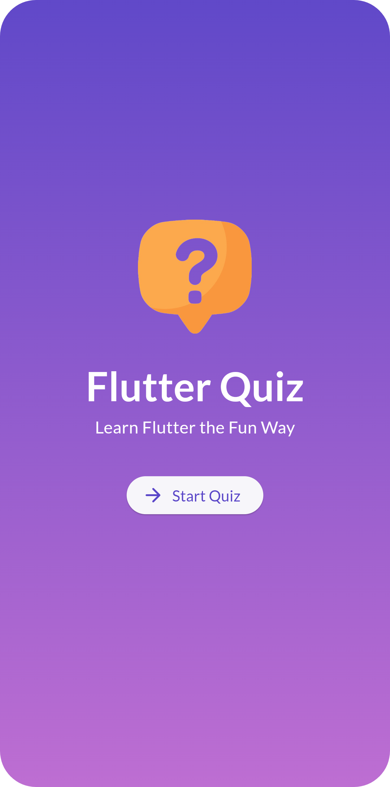
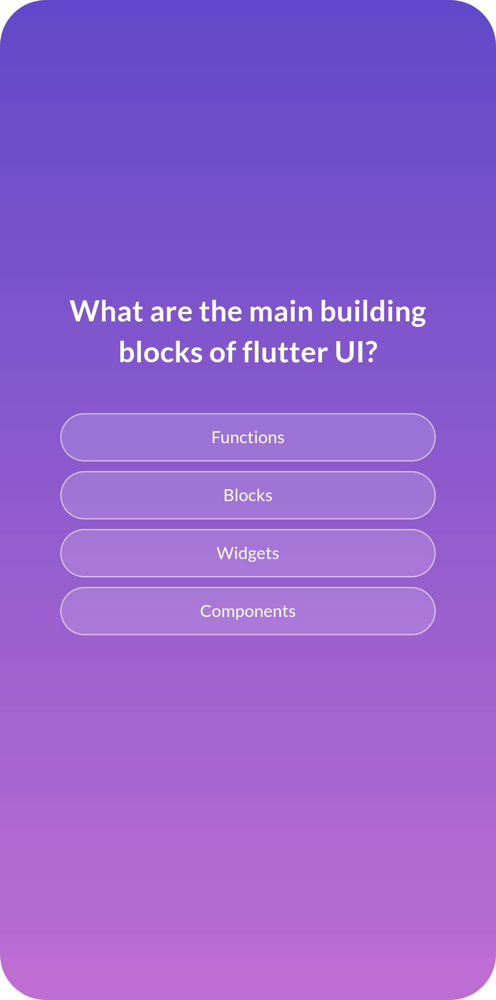
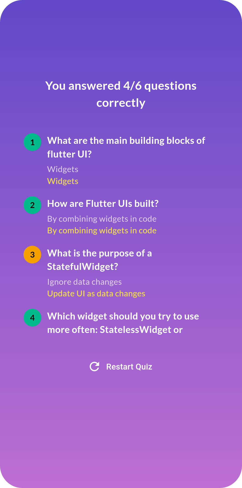

# Flutter Quiz

A simple quiz app built using flutter that test your knowledge of flutter. The Flutter-based quiz app presents multiple-choice questions with shuffled options. Users select answers, and proceed through questions. Upon completion, it displays total score, correct/incorrect attempts, and correct answers for review. Users can restart the quiz if desired. The app features intuitive navigation and visually appealing design for an engaging experience.

### Screenshots

